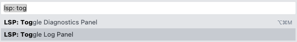

# Troubleshooting

## Logging

The language server produces detailed logs (including every LSP request
and response) which are send to stderr by default.

It may be helpful to share these logs when reporting bugs.

### stderr (default)

Most clients provide a way of inspecting these logs when server is launched
in the default "stdio" mode where stdout & stdin are used as communication
channels for LSP. For example:

[**Terraform VS Code Extension**](https://marketplace.visualstudio.com/items?itemName=HashiCorp.terraform)

1. `View` -> `Output`\
   
2. `Output` -> `HashiCorp Terraform`\
   

[**Sublime Text LSP-terraform**](https://github.com/sublimelsp/LSP-terraform)

1. Open the command palette via `⌘/Ctrl + Shift + P`
2. `LSP: Toggle Log Panel`\
   
3. See logs in the bottom pane\
   

### Logging to Files

Server logs can also be directed to files using **`-log-file=<filepath>`**
of the `serve` command.

```sh
$ terraform-ls serve -log-file='/tmp/terraform-ls-{{pid}}.log'
```

Clients which manage LS installation typically allow passing extra arguments.
For example:

[**Terraform VS Code Extension**](https://marketplace.visualstudio.com/items?itemName=HashiCorp.terraform)

1. Open the command palette via `⌘/Ctrl + Shift + P`
2. 
3. 

[**Sublime Text LSP-terraform**](https://github.com/sublimelsp/LSP-terraform)

1. Open the command palette via `⌘/Ctrl + Shift + P`
2. 
3. 

### Terraform CLI Execution Logs

Given that the server may also execute Terraform itself, it may be useful
to collect logs from all these executions too. This is equivalent
to setting [`TF_LOG_PATH` variable](https://www.terraform.io/internals/debugging).

This can be enabled via [`terraformLogFilePath` LSP settings](./SETTINGS.md#terraformlogfilepath-string).

Clients which manage LS installation typically expose this as a dedicated setting option.
For example:

[**Terraform VS Code Extension**](https://marketplace.visualstudio.com/items?itemName=HashiCorp.terraform)

1. Open the command palette via `⌘/Ctrl + Shift + P`
2. 
3. Set `"terraform-ls.terraformLogFilePath"` to a file path, such as `/tmp/tf-exec-{{lsPid}}-{{method}}-{{timestamp}}.log`

[**Sublime Text LSP-terraform**](https://github.com/sublimelsp/LSP-terraform)

1. Open the command palette via `⌘/Ctrl + Shift + P`
2. 
3. Set `terraformLogFilePath` under `initializationOptions`
```json
{
    "initializationOptions": {
        "terraformLogFilePath": "/tmp/tf-exec-{{lsPid}}-{{method}}-{{timestamp}}.log"
    }
}
```

### How To Share Logs

It is recommended to avoid pasting logs into the body of an issue,
unless you are trying to draw attention to a selected line or two.

It's always better to upload the log as [GitHub Gist](https://gist.github.com/)
and attach the link to your issue/comment, or [attach the file to your issue/comment](https://docs.github.com/en/github/managing-your-work-on-github/file-attachments-on-issues-and-pull-requests).

### Sensitive Data

Logs may contain sensitive data (such as content of the files being edited in the editor).
If you consider the content sensitive you may PGP encrypt it using [HashiCorp's key](https://www.hashicorp.com/security#secure-communications)
to reduce the exposure of the sensitive data to HashiCorp.

### Log Rotation

Keep in mind that the language server itself does not have any log rotation facility,
but the destination path will be truncated before being logged into.

Static paths may produce large files over the lifetime of the server and
templated paths (as described below) may produce many log files over time.

### Log Path Templating

Log paths support template syntax. This allows for separation of logs while accounting for:

 - multiple server instances
 - multiple clients
 - multiple Terraform executions which may happen in parallel

**`-log-file`** flag supports the following functions:

 - `timestamp` - current timestamp (formatted as [`Time.Unix()`](https://golang.org/pkg/time/#Time.Unix), i.e. the number of seconds elapsed since January 1, 1970 UTC)
 - `pid` - process ID of the language server
 - `ppid` - parent process ID (typically editor's or editor plugin's PID)

 **`terraformLogFilePath`** option supports the following functions:

  - `timestamp` - current timestamp (formatted as [`Time.Unix()`](https://golang.org/pkg/time/#Time.Unix), i.e. the number of seconds elapsed since January 1, 1970 UTC)
  - `lsPid` - process ID of the language server
  - `lsPpid` - parent process ID of the language server (typically editor's or editor plugin's PID)
  - `method` - [`terraform-exec`](https://pkg.go.dev/github.com/hashicorp/terraform-exec) method (e.g. `Format` or `Version`)

The path is interpreted as [Go template](https://golang.org/pkg/text/template/), e.g. `/tmp/terraform-ls-{{timestamp}}.log`.

## CPU Profiling

If the bug you are reporting is related to high CPU usage it may be helpful
to collect and share CPU profile which can be done via `cpuprofile` flag.

For example you can modify the launch arguments in your editor to:

```sh
$ terraform-ls serve \
	-cpuprofile=/tmp/terraform-ls-cpu.prof
```

Clients which manage LS installation typically allow passing extra arguments.
See [Logging to Files](#logging-to-files) section above for examples.

The target file will be truncated before being written into.

### Path Templating

Path supports template syntax. This allows for separation of logs while accounting for multiple server or client instances.

**`-cpuprofile`** supports the following functions:

 - `timestamp` - current timestamp (formatted as [`Time.Unix()`](https://golang.org/pkg/time/#Time.Unix), i.e. the number of seconds elapsed since January 1, 1970 UTC)
 - `pid` - process ID of the language server
 - `ppid` - parent process ID (typically editor's or editor plugin's PID)

The path is interpreted as [Go template](https://golang.org/pkg/text/template/), e.g. `/tmp/terraform-ls-cpuprofile-{{timestamp}}.log`.

## Memory Profiling

If the bug you are reporting is related to high memory usage it may be helpful
to collect and share memory profile which can be done via `memprofile` flag.

For example you can modify the launch arguments in your editor to:

```sh
$ terraform-ls serve \
	-memprofile=/tmp/terraform-ls-mem.prof
```

Clients which manage LS installation typically allow passing extra arguments.
See [Logging to Files](#logging-to-files) section above for examples.

The target file will be truncated before being written into.

### Path Templating

Path supports template syntax. This allows for separation of logs while accounting for multiple server or client instances.

**`-memprofile`** supports the following functions:

 - `timestamp` - current timestamp (formatted as [`Time.Unix()`](https://golang.org/pkg/time/#Time.Unix), i.e. the number of seconds elapsed since January 1, 1970 UTC)
 - `pid` - process ID of the language server
 - `ppid` - parent process ID (typically editor's or editor plugin's PID)

The path is interpreted as [Go template](https://golang.org/pkg/text/template/), e.g. `/tmp/terraform-ls-memprofile-{{timestamp}}.log`.
