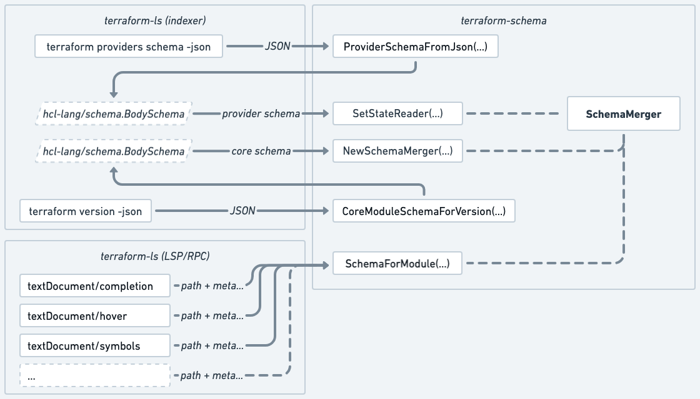

# Language Server Architecture

This is a summary of some main components of the language server, aiming to help maintainers and contributors with navigating the codebase.

## Decoder

Majority of the language server functionality such as completion, hover, document links, semantic tokens, symbols etc. are provided by [the `decoder` package of `hashicorp/hcl-lang`](https://pkg.go.dev/github.com/hashicorp/hcl-lang@main/decoder). `hcl-lang` is generally considered a reusable component for any HCL2-based language server (that is not _just_ Terraform). Any functionality which other HCL2-based language server may reuse should be contributed there, not into `terraform-ls`.

The decoder essentially takes in directories of parsed HCL files + schemas and uses both to walk the AST to provide completion candidates, hover data and other relevant data.

## Schema

Decoder needs schema to produce relevant completion candidates, hover data etc. [`hashicorp/terraform-schema`](https://pkg.go.dev/github.com/hashicorp/terraform-schema) houses most of the Terraform Core schema (such as `terraform`, `resource` or `variable` blocks) + helpers to combine that [Core schema](https://github.com/hashicorp/terraform-schema/tree/main/internal/schema) with provider schemas (such as inner parts of `resource` or `data` blocks) and help assemble schemas for modules.

## State

Most of the state is maintained within various [`go-memdb`](https://pkg.go.dev/github.com/hashicorp/go-memdb) tables under [`state`](https://pkg.go.dev/github.com/hashicorp/terraform-ls@main/internal/state) package, passed around via [`state.StateStore`](https://pkg.go.dev/github.com/hashicorp/terraform-ls@main/internal/state#StateStore).

This includes

 - `documents` - documents open by the client (see [Document Storage](#document-storage))
 - `jobs` - pending/running jobs (see [Job Scheduler](#job-scheduler))
 - `modules` - AST and other metadata about Terraform modules collected by indexing _jobs_ ^
 - `provider_schemas` - provider schemas pre-baked or obtained via Terraform CLI by indexing _jobs_ ^
 - `provider_ids` & `module_ids` - mapping between potentially sensitive identifiers and randomly generated UUIDs, to enable privacy-respecting telemetry

## Document Storage

`documents` package, and [`document.Document`](https://pkg.go.dev/github.com/hashicorp/terraform-ls@main/internal/document#Document) struct in particular represents open documents server receives from the client via LSP text synchronization methods such as `textDocument/didOpen`, `textDocument/didChange`, stored as an entry in the `documents` memdb table. The `textDocument/didClose` method removes the document from state, making other components assume that it then matches OS filesystem.

AST representation of these documents is passed to the decoder, which in turn ensures that all completion candidates, hover data etc. is relevant to what the user sees in their editor window even if the file/document is not saved.

Each document also maintains line-separated version, to enable line-based diffing and to enable conversion between LSP's representation of position (line:column) to HCL's representation (`hcl.Pos`) which mostly uses byte offsets.

## Filesystem

`filesystem` package provides an `io/fs` compatible interface primarly for any jobs which need to operate on the whole directory (Terraform module) regardless of where the file contents comes from (virtual document or OS filesystem).

## LSP/RPC Layer

`langserver` package represents the RPC layer responsible for processing any incoming and outgoing LSP (RPC JSON) requests/responses between the server and client. The `langserver/handlers` package generally follows a pattern of 1 file per LSP method. The package also contains E2E tests which exercise the language server from client's perspective. [`service.go`](https://github.com/hashicorp/terraform-ls/blob/main/internal/langserver/handlers/service.go) represents the "hot path" of the LSP/RPC layer, basically mapping functions to method names which the server supports.

[`protocol`](https://pkg.go.dev/github.com/hashicorp/terraform-ls@main/internal/protocol) package represents the structs reflecting LSP spec, i.e. the structure of request and response JSON bodies. Given that there is no other complete and/or well-maintained representation of the LSP spec for Go (at the time of writing), majority of this is copied from within `gopls`, which in turn generates these from the TypeScript SDK - practically the only officialy maintained and most complete implementation of LSP spec to date.

Mentioned `protocol` request/response representations may not always be practical throughout the codebase and within `hcl-lang`, therefore `lsp` package contains various helpers to convert the `protocol` types from and to other internal types we use to represent the same data. It also filters and checks the data using client and server capabilities, such that other parts of the codebase don't have to.

## Job Scheduler

In order to provide relevant and timely help across the whole workspace, the language server has to perform indexing of Terraform config files. `terraform/module/module_ops.go` currently represents all the different indexing jobs required to obtain all kind of data and metadata, to power completion, hover, go-to-definition etc. 

 - `GetTerraformVersion` - obtains Terraform version via `terraform version -json`
 - `ObtainSchema` - obtains provider schemas via `terraform providers schema -json`
 - `ParseModuleConfiguration` - parses `*.tf` files to turn `[]byte` into `hcl` types (AST)
 - `ParseVariables` - parses `*.tfvars` files to turn `[]byte` into `hcl` types (AST)
 - `ParseModuleManifest` - parses module manifest with metadata about any installed modules
 - `LoadModuleMetadata` - uses [`earlydecoder`](https://pkg.go.dev/github.com/hashicorp/terraform-schema@main/earlydecoder) to do early TF version-agnostic decoding to obtain metadata (variables, outputs etc.) which can be used to do more detailed decoding in hot-path within `hcl-lang` decoder
 - `DecodeReferenceTargets` - uses `hcl-lang` decoder to collect reference targets within `*.tf`
 - `DecodeReferenceOrigins` - uses `hcl-lang` decoder to collect reference origins within `*.tf`
 - `DecodeVarsReferences` - uses `hcl-lang` decoder to collect references within `*.tfvars`

These jobs are scheduled either via [walker](#walker) or [watcher](#watcher) (both of which are started by `initialize` LSP request), or more directly by `textDocument/didOpen` or `textDocument/didChange` LSP requests (by corresponding handlers). `textDocument/*`-triggered jobs could in theory be just executed straight from within the request handlers, but this would increase the chances of running the same job twice (within the indexer and handler). Executing these jobs the same way (with single entry point) avoids this problem.

All these jobs end up in the `jobs` memdb table, from where they're picked up from by any of the two schedulers described below.

[`scheduler`](https://pkg.go.dev/github.com/hashicorp/terraform-ls@main/internal/scheduler) contains a relatively general-purpose implementation of a job scheduler. There are [two instances](https://github.com/hashicorp/terraform-ls/blob/031e30f62ab169104837fbb1e9ef2633ded73329/internal/langserver/handlers/service.go#L427-L435) of the scheduler in use, both of which are launched by `initialize` LSP request and shut down with `shutdown` LSP request.

 - `openDirIndexer` processes any jobs concerning directories which have any files open
 - `closedDirIndexer` processes any jobs concerning directories which do _not_ have any files open

The overall flow of jobs is illustrated in the diagram below.

The mentioned `documents` memdb table is consulted for whether a directory has any open files - i.e. whether server has received `textDocument/didOpen` and _not_ `textDocument/didClose` concerning a particular directory. Using two separate schedulers loosely reflects the fact that data for files which the user is editing at the moment are more critical, unlike additional data about other directories/modules which would only _enrich_ editing of the open files (such as by adding cross-module context, providing go-to-definition etc.).

Jobs also depend on each other. These dependencies are illustrated in the diagrams below.

### Walker

### Text-Sync Notifications

## Walker

Walker is responsible for walking the filesystem hierarchy of the whole workspace (including files which may not be open by the user) on the background, to provide richer data in completion, hover etc. and to enable go-to-definition and other cross-module functionality. All indexing is scheduled as jobs via Job Scheduler and executed asynchronously, such that walking the hierarchy can scale independently of the indexing. As mentioned in [Job Scheduler](#job-scheduler) section, walker follows the LSP/RPC lifecycle of the server, i.e. it is launched by `initialize` request and shut down by `shutdown` request.

Most walker functionality is contained within [`terraform/module/walker.go`](https://github.com/hashicorp/terraform-ls/blob/main/internal/terraform/module/walker.go).

## Watcher

Watcher is responsible for watching for certain changes on the filesystem. Generally LSP discourages servers from watching the filesystem, but it doesn't make it easy for server to indicate what files client should watch. Clients are generally in control of what files/patterns are watched and sent to the server. This design works for editable documents (such as `*.tf` or `*.tfvars` in Terraform) - and follow that design there by relying entirely on clients there, but it doesn't work as well for other (important but not editable) metadata which may affect the UX.

Metadata relevant and worth watching in Terraform include most of `.terraform` directory, which contains module and provider metadata. This data is important for LS to understand e.g. where to find installed modules on the filesystem, or (indirectly) to know when to obtain schemas via `terraform providers schema -json`.

The directory (and hence the metadata) may change at runtime (during the lifecycle of LS) anytime user runs `terraform init` or `terraform get` and watching these files enables LS to have up-to-date metadata.

Most watcher functionality is contained within [`terraform/module/watcher.go`](https://github.com/hashicorp/terraform-ls/blob/main/internal/terraform/module/watcher.go).

