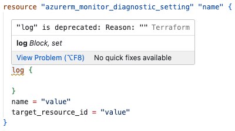

# Validation

The language server produces various types of diagnostics as you type.

## HCL syntax

Starting in `v0.8.0` we report diagnostics for invalid [HCL syntax](https://github.com/hashicorp/hcl/blob/main/spec.md),
for example missing `}`, `"` or other "control characters" out of place.

HCL syntax alone does _not_ account for the Terraform language with all its (in)valid
keywords, block or attribute names etc. nor differences between Terraform versions, that is handled elsewhere.

## Early Validation

Starting in `v0.32.0` we report additional diagnostics for selected invalid Terraform language constructs
based on detected Terraform version and provider versions (if available).

This validation is enabled by default but can be controlled via
[`validation.enableEarlyValidation`](./SETTINGS.md#enableearlyvalidation-bool-defaults-to-true).

All validation rules currently implemented are considered _universally applicable_
and _not opinionated_. If you believe a diagnostic is incorrect, this may be caused by
mis-identified version of Terraform or provider version. You can temporarily disable
validation in such a case and let us know by [filing a new issue](https://github.com/hashicorp/terraform-ls/issues/new/choose).

See supported rules below.

### Module Files (`*.tf`)

#### Incorrect Number of Block Labels

#### Deprecated Attribute

#### Deprecated Block

#### Exceeded Maximum Number of Blocks

For blocks which have a maximum we check if the number was not exceeded.

#### Mising Required Blocks

For blocks which have an expected minimum we check if the number of blocks was met.

#### Missing Required Attribute

#### Unexpected Attribute

#### Unexpected Block

#### Reference to Undeclared Block or Attribute

This validation has a limited scope to variables (`var.*` / `variable` blocks)
and local values (`local.*` / `locals`) for now.

### Variable Files (`*.tfvars`)

#### Unknown variable name

Each entry in the file is checked against its corresponding `variable` declaration
and entries without declaration are considered invalid.

#### Unexpected blocks

Blocks are not considered as valid in variable files.

